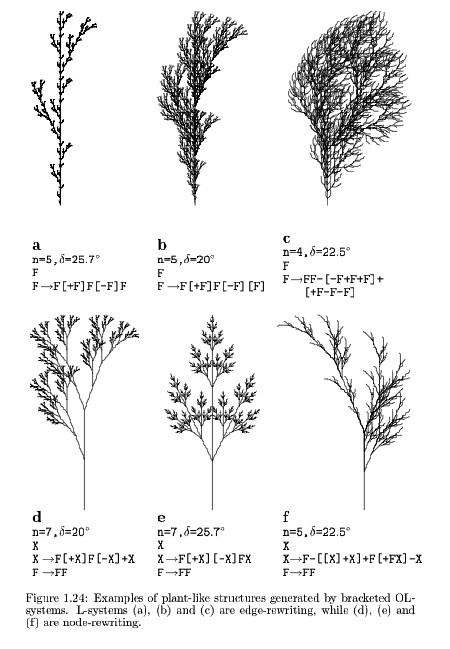

# L-System

> An **L-system** or **Lindenmayer system** is a parallel rewriting system and a type of formal grammar...
>
> Read more on https://en.wikipedia.org/wiki/L-system

## Please, look at this experiment in action [here](https://renecura.github.io/l-system/).